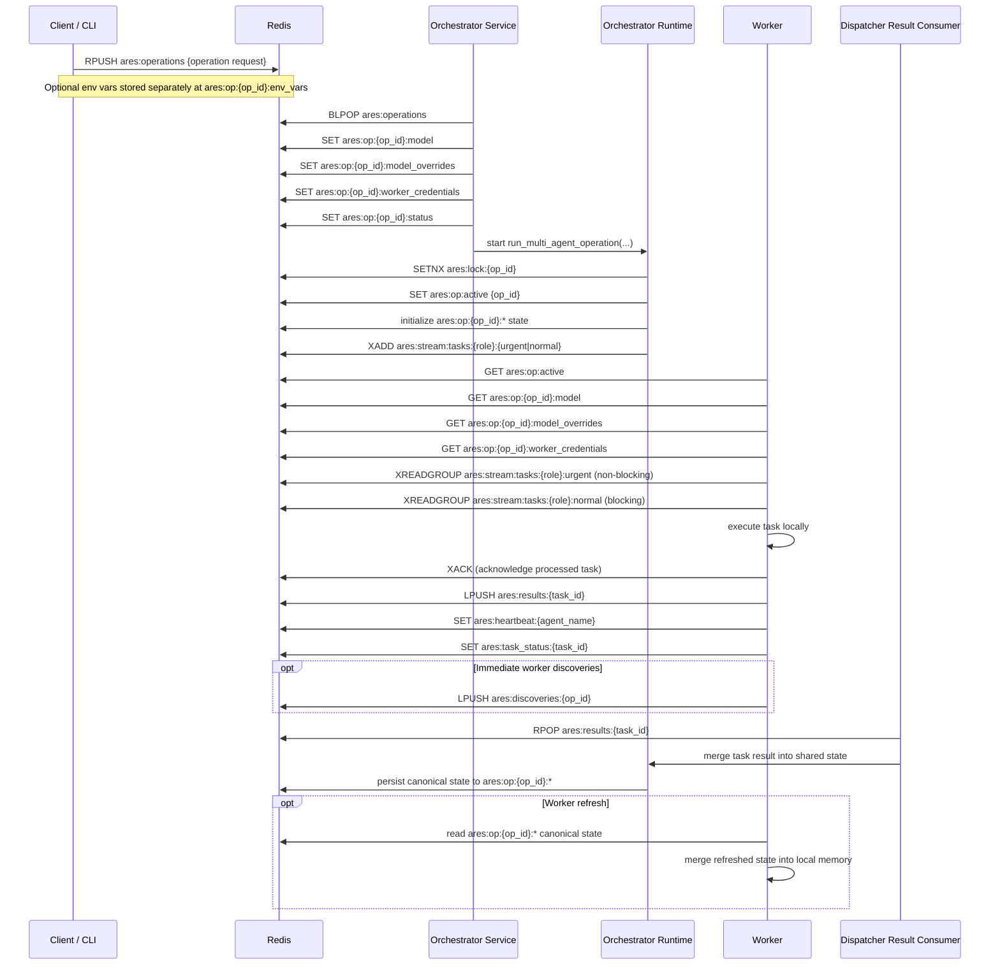

# Red Team Redis Architecture

This document describes the Redis contract used by the red team orchestrator
and worker agents.

It is intended to answer three questions:

1. Which Redis keys exist, and what owns them?
2. How do orchestrator and workers communicate through Redis?
3. Which Redis-backed state is considered canonical during recovery and worker
   refresh?

## Overview

Redis is used for two separate concerns:

- Transport: operation submission, role task queues, task results, heartbeats,
  and fast-path discoveries
- Canonical state: per-operation shared red team state under
  `ares:op:{operation_id}:*`

The important distinction is that queues move work, but the
`ares:op:{operation_id}:*` keys are the durable source of truth for operation
state, recovery, and worker refresh.

## End-to-End Sequence

## Key Ownership

| Key Pattern | Type | Written By | Read By | Purpose |
| ----------- | ---- | ---------- | ------- | ------- |
| `ares:operations` | List | Client / CLI | Orchestrator service | Operation submission queue |
| `ares:op:{op_id}:env_vars` | String | Client / CLI | Orchestrator service | Temporary secret/env handoff |
| `ares:op:{op_id}:status` | String | Orchestrator service | CLI, workers, recovery helpers | High-level operation status |
| `ares:op:{op_id}:model` | String | Orchestrator service | Workers | Per-operation model selection |
| `ares:op:{op_id}:model_overrides` | String | Orchestrator service | Workers | Per-role model override config |
| `ares:op:{op_id}:worker_credentials` | String | Orchestrator service | Workers | API credentials for worker LLM calls |
| `ares:lock:{op_id}` | String | Orchestrator runtime | Workers, recovery | Operation exclusivity / liveness |
| `ares:op:active` | String | Orchestrator runtime | Workers | Active operation discovery pointer |
| `ares:stream:tasks:{role}:urgent` | Stream | Orchestrator / dispatcher | Workers (consumer group) | Urgent/retry task stream (priority ≤ 2) |
| `ares:stream:tasks:{role}:normal` | Stream | Orchestrator / dispatcher | Workers (consumer group) | Normal task stream (priority > 2, FIFO) |
| `ares:results:{task_id}` | List | Workers | Dispatcher result consumer | Task result mailbox |
| `ares:heartbeat:{agent_name}` | String | Workers | Dispatcher | Worker liveness and current task |
| `ares:task_status:{task_id}` | String | Workers | CLI / operators | Task debugging and runtime status |
| `ares:discoveries:{op_id}` | List | Workers | Dispatcher | Immediate discovery fast path |
| `ares:state:updates:{op_id}` | Pub/Sub | CLI helpers today | Workers | State refresh notifications |

## Canonical Operation State

The canonical Redis-backed shared state lives under
`ares:op:{operation_id}:*`. This is loaded during:

- orchestrator recovery
- worker startup recovery
- worker state refresh
- CLI inspection/report generation

Common keys:

| Key Pattern | Type | Notes |
| ----------- | ---- | ----- |
| `ares:op:{op_id}:meta` | Hash | Scalars like `started_at`, target info, completion flags |
| `ares:op:{op_id}:credentials` | Hash | Deduped credentials |
| `ares:op:{op_id}:hashes` | Hash | Deduped hashes |
| `ares:op:{op_id}:hosts` | List | Hosts discovered |
| `ares:op:{op_id}:users` | List | Users discovered |
| `ares:op:{op_id}:shares` | List | Shares discovered |
| `ares:op:{op_id}:weaknesses` | Hash | Weakness blocks |
| `ares:op:{op_id}:domains` | Set | Known domains |
| `ares:op:{op_id}:vulns` | Hash | Discovered vulnerabilities |
| `ares:op:{op_id}:exploited` | Hash / set-backed state | Exploited vulnerability tracking |
| `ares:op:{op_id}:pending_tasks` | Hash | Dispatcher throttle/recovery state |
| `ares:op:{op_id}:completed_tasks` | Hash | Completed task cache / dedup |
| `ares:op:{op_id}:dc_map` | Hash | Domain controller mapping |
| `ares:op:{op_id}:netbios_map` | Hash | NetBIOS to FQDN mapping |
| `ares:op:{op_id}:artifacts` | Hash | Downloaded artifacts |
| `ares:op:{op_id}:timeline` | List / hash-backed timeline state | Operation timeline |
| `ares:op:{op_id}:domain_admin_domains` | Set | Domains where DA was achieved |
| `ares:op:{op_id}:domain_sids` | Hash | Cached domain SID data |

## Component Responsibilities

### Client / CLI

- submits operation requests into `ares:operations`
- optionally stores env vars in `ares:op:{op_id}:env_vars`
- reads operation status and shared state for inspection tools

### Orchestrator Service

- owns operation request consumption
- materializes per-operation config for workers
- transitions operation status through `submitted`, `running`,
  `completed`, or `failed`

### Orchestrator Runtime

- acquires the per-operation lock
- sets the active operation pointer
- initializes canonical shared state
- submits tasks to role queues
- persists merged shared state back to Redis

### Workers

- discover active operations via `ares:op:active` or `ares:op:*:meta`
- read operation model/config/credentials from Redis
- block on `ares:tasks:{role}`
- send results to `ares:results:{task_id}`
- publish heartbeat and task status
- refresh local state from canonical `ares:op:{op_id}:*`

### Dispatcher Result Consumer

- consumes worker results
- merges discoveries into in-memory shared state
- persists checkpointed/shared state back into canonical Redis keys
- polls `ares:discoveries:{op_id}` for fast-path follow-up actions

## Main Branch Contract

On `main`, the practical contract is:

- Redis Streams (with consumer groups) move tasks between orchestrator and
  workers. Two streams per role: `urgent` (priority ≤ 2, retries) and `normal`.
  Workers XACK after processing; unacknowledged tasks can be reclaimed via
  XAUTOCLAIM.
- Redis result queues (Lists) return task completion back to the dispatcher
- Redis canonical state under `ares:op:{op_id}:*` is the durable source of
  truth for recovery and worker refresh

That means a branch is only Redis-compatible with `main` if:

- transport keys still behave the same
- worker refresh reloads all Redis-backed canonical fields needed by the branch
- new Redis-backed state is both persisted and reloaded consistently

## Branch Notes

This branch adds multi-forest state that also participates in the Redis
contract:

- `domain_admin_domains`
- `domain_sids`
- `netbios_to_fqdn`
- `da_hash_id`

Those fields must be treated like the rest of canonical Redis-backed state:

- persisted during checkpoint or direct write-through paths
- reloaded during operation recovery
- reloaded during worker refresh
- merged into worker local state without being dropped

## Relevant Code

- `src/ares/core/task_queue.py`
- `src/ares/core/orchestrator_service.py`
- `src/ares/core/orchestrator/_orchestrator.py`
- `src/ares/core/dispatcher/_dispatcher.py`
- `src/ares/core/dispatcher/monitoring.py`
- `src/ares/core/dispatcher/persistence.py`
- `src/ares/core/dispatcher/result_processing.py`
- `src/ares/core/worker/_worker.py`
- `src/ares/core/worker/operations.py`
- `src/ares/core/state_backend.py`
- `src/ares/core/recovery.py`
